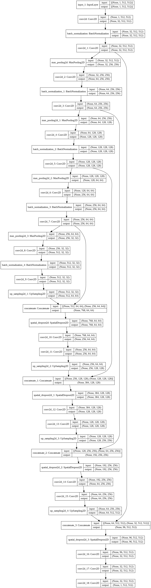

# NoduleDetector007

## Configuration

### 1ProcessNoduleDataset.ipynb

Set path to dataset localization folder
```python

#Path to csv files available in repository
metadatapath = "/content/drive/MyDrive/LIDC/metadata_test.csv"
list32path = "/content/drive/MyDrive/LIDC/list3.2.csv"


DOIfolderpath ='/content/drive/MyDrive/LIDC-IDRI/'  # Path to dataset folder


outfolder = '/content/drive/MyDrive/out/LungNoduleDetectionClassification/'+str_start+'_'+str_end+'/'
datafolder = outfolder+'processeddata'
```

### 2TrainUnet.ipynb
Set path to dataset localization 
```python
noduleimages=np.load(datafolder+"/noduleimages_"+pf_last+".npy") # path to lungs images after segmentation
nodulemasks=np.load(datafolder+"/nodulemasks_"+pf_last+".npy") # path to mask images after segmentation
nodulemaskscircle=np.load(datafolder+"/nodulemaskscircle_"+pf_last+".npy") # path to mask images after segmentation (2nd approach)
```

If you want to load your model from file set it localization, if not - skip execution of this cell
```python
model = unet
filepath=weightsfolder+"/unet-unet-"+K.image_data_format()+"-weights-improvement_"+pf_last+".hdf5" # HERE

load_status = model.load_weights(filepath)
```
Set filepath where model should be saved
```python3
unet.compile(optimizer=Adam(lr=1e-5), loss=dice_coef_loss, metrics=[dice_coef])
filepath=weightsfolder+"/unet-unet"+K.image_data_format()+"-weights-improvement_"+pf+".hdf5" # HERE

checkpoint = ModelCheckpoint(filepath, monitor='loss', verbose=1, save_best_only=True)
history_unet = unet.fit(imagestrain, maskstrain, batch_size=4, epochs=10, verbose=1, shuffle=True,
              callbacks=[checkpoint],validation_data=(imagestest,maskstest))
K.clear_session()
```

Model visualization



=====================================

(Old model visualization)


